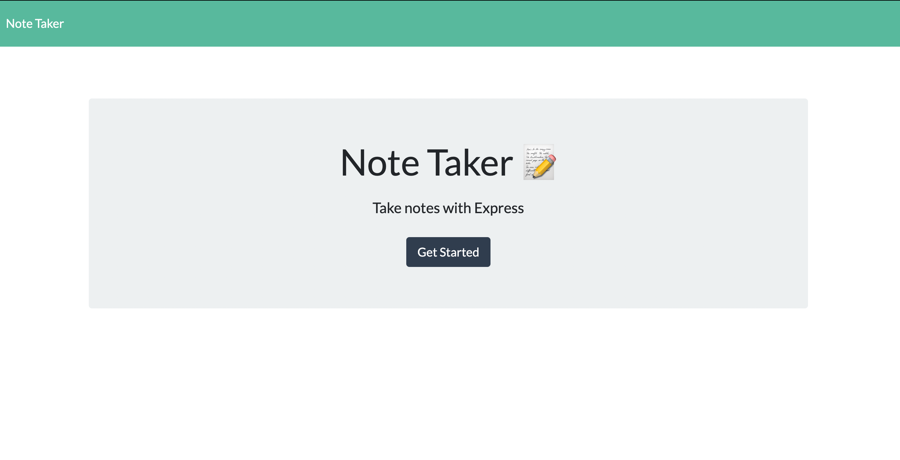
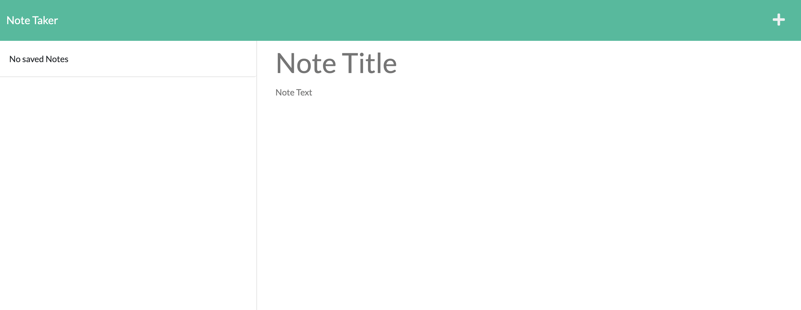
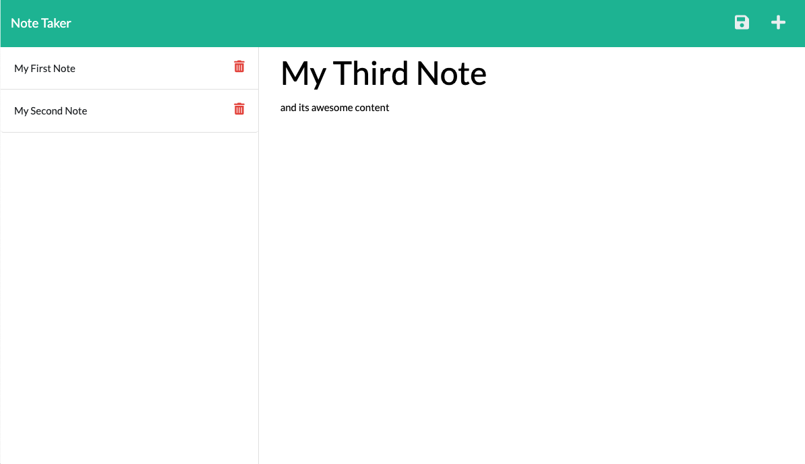
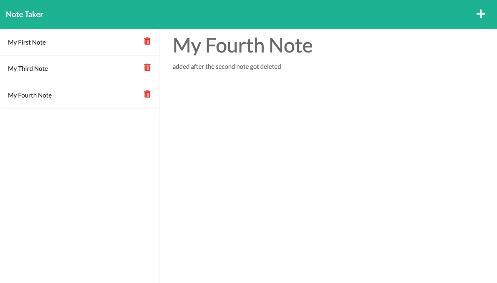

# note-taker

 

## Description

An app used for writing and saving notes. The app uses Express.js for backend and saves/retreives data from a JSON file.
 
 

## Motivation

The purpose of this app is to practise working with Express.js, npm, fs, path, uuid, routes, API requests and more.
 
 
[Link to the deployed app](https://jitkas-note-taker.herokuapp.com/)
 
 

## User Story

As a small business owner I want to be able to write and save notes so that I can organize my thoughts and keep track of tasks I need to complete.
 
 

## Usage

App is live. Open this [link](https://jitkas-note-taker.herokuapp.com/) and start using the app typing/saving/deleting your notes.

 

## Acceptance Criteria

WHEN I open the Note Taker, I am presented with a landing page with a link to a notes page.

WHEN I click on the link to the notes page, I am presented with a page with existing notes listed in the left-hand column, plus empty fields to enter a new note title and the note’s text in the right-hand column.

WHEN I enter a new note title and the note’s text, a Save icon appears in the navigation at the top of the page.

WHEN I click on the Save icon, the new note I have entered is saved and appears in the left-hand column with the other existing notes.

WHEN I click on an existing note in the list in the left-hand column, that note appears in the right-hand column.

WHEN I click on the Write icon in the navigation at the top of the page, I am presented with empty fields to enter a new note title and the note’s text in the right-hand column.

 

## Screenshots

 

